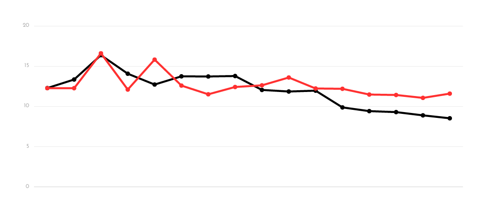
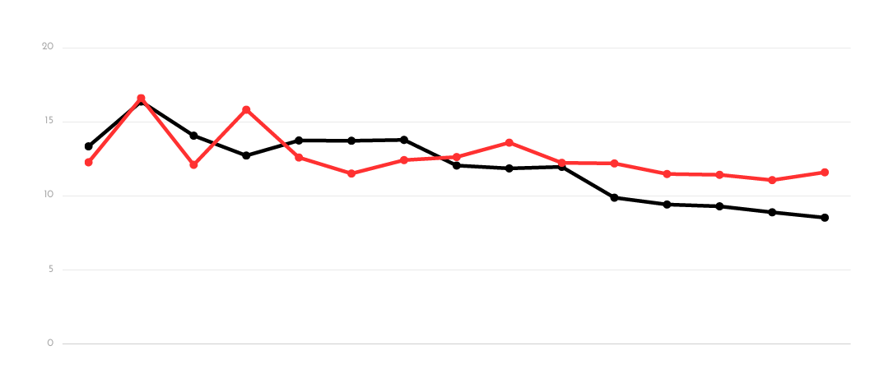
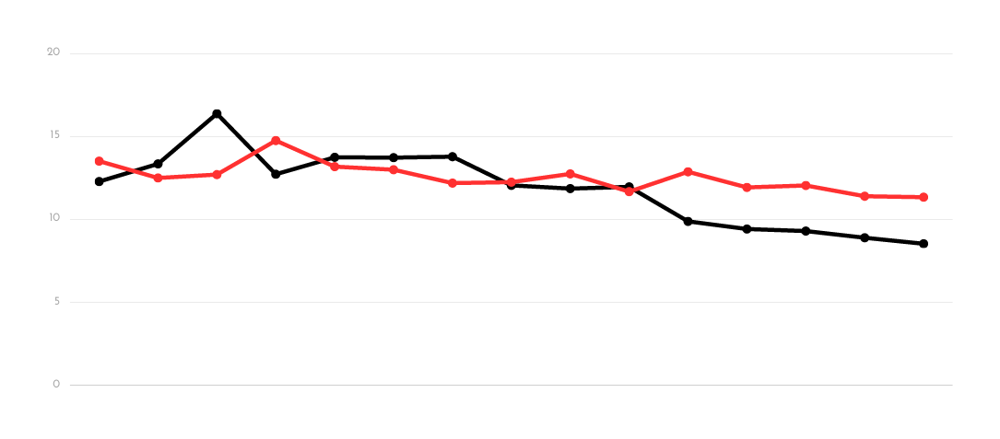
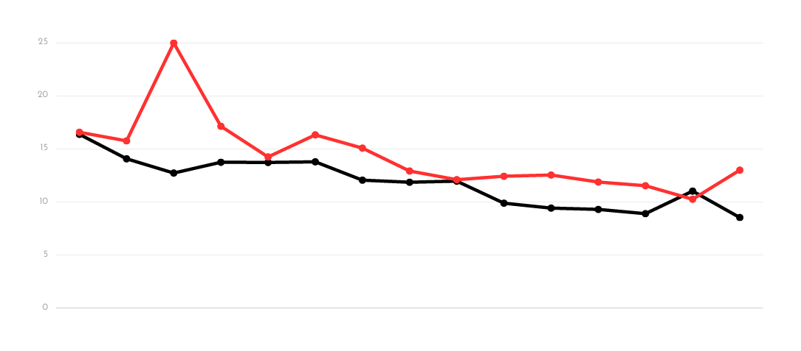
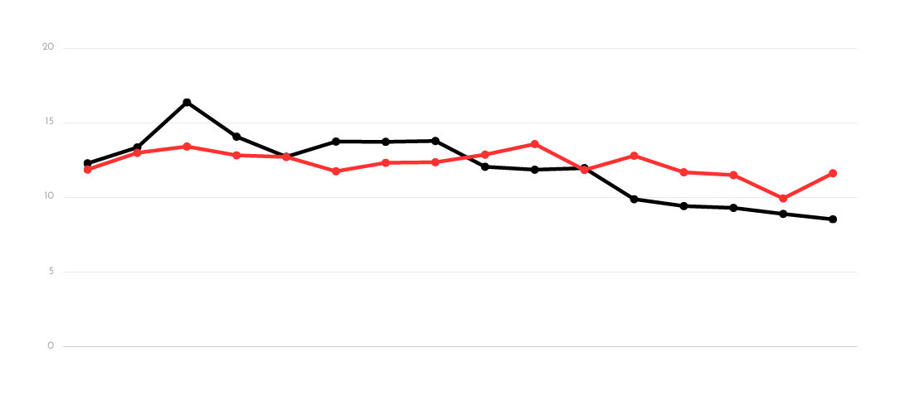

## FP.1
> Match bounding boxes

```c++
    std::map<int, int> prevBoxCounter;
    for(BoundingBox &boxCurr: currFrame.boundingBoxes)
    {
        prevBoxCounter.clear();
        for(cv::DMatch &match: matches)
        {
            for(BoundingBox &boxPrev: prevFrame.boundingBoxes)
            {
                bool isCurr = boxCurr.roi.contains(currFrame.keypoints[match.trainIdx].pt);
                bool isPrev = boxPrev.roi.contains(prevFrame.keypoints[match.queryIdx].pt);
                
                if(isCurr && isPrev) prevBoxCounter[boxPrev.boxID]++;
            }
        }

        // Find the box from previous frame with maximum matches
        auto less_than = [](const auto& a, const auto& b){return a.second < b.second;};
        auto maxPrev = *std::max_element(prevBoxCounter.begin(), prevBoxCounter.end(), less_than);
        bbBestMatches[maxPrev.first] = boxCurr.boxID; 
    }
```    

For each bounding box in current frame, the number of assoiciated matches for each bounding box in previous frame is computed.
The bounding box in previous frame with maximum number of associated matches is selected as the pair.
A pre-processing step was additionally added to remove keypoint matches with keypoints that are in more than one bounding box, this situation is normally not expected but the check is there just in case.

## FP.2

> TTC using lidar with outlier handling

```c++
    std::transform(lidarPointsPrev.begin(), lidarPointsPrev.end(), xPrev.begin(), [](auto& point){return point.x;}); 
    std::transform(lidarPointsCurr.begin(), lidarPointsCurr.end(), xCurr.begin(), [](auto& point){return point.x;});

    double xPrevMean = std::accumulate(xPrev.begin(), xPrev.end(), 0.0) / xPrev.size();
    double xCurrMean = std::accumulate(xCurr.begin(), xCurr.end(), 0.0) / xCurr.size();
```
The distance is computed using the mean of the cluster rather than the nearest point, this reduces the effect of outliers.


## FP.3

> Cluster keypoint matches by bounding box with outlier removal

```c++
    
    for (cv::DMatch &match: kptMatches)
    {
        if(boundingBox.roi.contains(kptsCurr[match.trainIdx].pt)) 
        {
            boundingBox.kptMatches.push_back(match);
        }
```

```c++
    std::vector<cv::DMatch> inliers;
    double lowerLimit = kptDistMean - (1.8 * KptDistSD);
    double upperLimit = kptDistMean + (1.8 * KptDistSD);
    for(size_t i = 0; i < kptDistances.size(); i++)
    {
        if(kptDistances[i] >= lowerLimit && kptDistances[i] <= upperLimit)
        {
            inliers.push_back(boundingBox.kptMatches[i]);
        }
    }
    boundingBox.kptMatches = inliers;
```

The matches with keypoints that lie within ROI of the given bounding box is added to the bouding box match list.
The mean and standard deviation for the match distances is computed and then the standard deviation is used to remove outlier points.


## FP.4

> TTC using camera with outlier handling

```c++
    // Now we have distance ratios for all keypoint match pairs
    // Compute the median 
    if (distanceRatios.size() > 0)
    {
        std::sort(distanceRatios.begin(), distanceRatios.end());
        int medianIdx = floor(distanceRatios.size() / 2.0);

        double medianDistanceRatio = medianIdx % 2 == 0 ? (distanceRatios[medianIdx] + distanceRatios[medianIdx - 1]) / 2.0 : distanceRatios[medianIdx];

        double dT = (1.0 / frameRate);
        TTC = -dT / (1 - medianDistanceRatio);

    }
    else
        TTC = std::numeric_limits<double>::quiet_NaN();
```

Once we have the distance ratios ($h1/h0$), we find the medain ratio value and use this as the representative for computing TTC.
This ensures that any effect of outliers is minimal.

## FP.5 and FP.6

> Lidar and camera TTC evaluation

FAST + ORB


FAST + BRIEF


FAST + BRISK


BRISK + BRISK


FAST + FREAK



Black line is lidar TTC and red line is camera TTC.

The above combinations of detector and descriptor were selected for use in TTC computation based on multiple factors collected from mid-term prject.

1. Detection + Description speed
2. Number of keypoint detection
3. Number of keypoint matches

The combinations above are ordered based on the above factors.

Out of the selected combinations, the best 2 are 

1. FAST + BRISK
2. FAST + FREAK

This performace can be attributed to the quality of keypoints detected by the FAST detector.

The descripancies (sudden jumps) in the lidar and camera TTC as seen from the graphs can be attributed to 2 factors.

1. The constant velocity model not being able to account for breaking of the car in front.
2. Residual influence of outlier points in the clusterd data.
